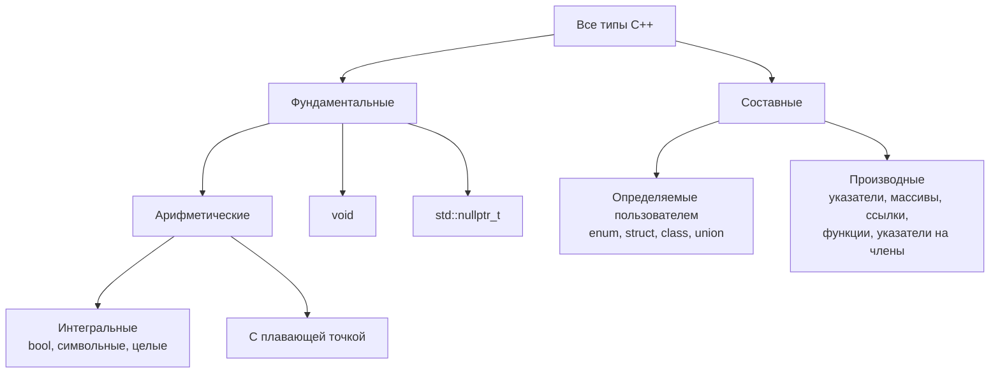

> [!info] О конспекте
> Расшифровка фотографий конспекта преподавателя (Obsidian-курс «зумк1 · структурное программирование», раздел «теория · раздел 1»). Текст воспроизведён почти дословно. Продолжение после [[lekciya-05|Лекции 5]].
> Раздел лекции: [[#1.1.2.2 Классификация типов данных C++]].

---

## 1.1.2.2 Классификация типов данных C++

### Полный список типов

**Фундаментальные типы:**

1. логический тип (`bool`);
2. символьные типы (`char` и др.);
3. целые типы (`int` и др.);
4. типы с плавающей точкой (`double` и др.);
5. тип `void`;
6. тип нулевого указателя `std::nullptr_t` — тип литерала `nullptr` (см. §1.1.2.1 «Фундаментальные типы данных C++»).

**Составные типы:**

7. перечислимые типы (`enum`, `enum class`) для представления значений из конкретного множества;
8. указатели (`int*`);
9. массивы (`char[]`);
10. ссылки — lvalue-ссылки (`double&`) и rvalue-ссылки (`double&&`);
11. структуры (`struct`), классы (`class`) и объединения (`union`);
12. функции (`int(double)`) и указатели на функции (`int (*ptr)(double)`);
13. указатели на члены класса — `int C::*ptr`.

Рассмотрим их по категориям:

- пункты 1–3 — **интегральные типы**;
- пункты 1–4 — **арифметические типы**;
- перечисления, классы и объединения (7, 11) — **типы, определяемые пользователем**: в отличие от фундаментальных, их нужно явно определить в коде программы, прежде чем использовать; остальные типы называются **встроенными**;
- указатели, массивы, ссылки, функции и указатели на члены (8–10, 12, 13) — **производные типы**: строятся на основе любого другого типа.

### Схема классификации



На схеме видны сразу две оси <!-- TODO: начало фразы на фото обрезано --> — кто определяет тип: голубые ветви это **встроенные** типы, розовая — **определяемые пользователем**. Оси независимы, поэтому «встроенный» и «фундаментальный» — не синонимы: производные типы (указатели, массивы, ссылки) встроенные, но не фундаментальные.

> [!tip] У интегральных типов есть точное отношение равенства.
> Поэтому, например, конструкция выбора `switch` (см. §1.2.5 «Инструкции выбора») работает с ними (и ещё перечислениями и объектами, которые могут быть преобразованы к целым), а с типами плавающей точки — нет.

Ранее мы рассмотрели фундаментальные типы. Далее рассмотрим базовые возможности некоторых составных типов.

---

## Пользовательские типы

### Перечисление (enum)

> [!note] Перечисление (enumeration, `enum`)
> пользовательский тип, множество допустимых значений которого задано явным списком именованных констант-перечислителей (enumerator); в памяти значение хранится как целое число.

Перечисление используют там, где переменная может принимать значения только из небольшого фиксированного набора: цвет светофора, день недели, состояние соединения. Вместо «магических чисел» `0`, `1`, `2` в коде появляются осмысленные имена, а компилятор начинает следить за тем, чтобы в переменную не попало постороннее значение.

> [!example] Пример 1.9 — Перечисление `enum class`
> ```cpp
> #include <iostream>
>
> enum class Color { RED, GREEN, BLUE };   // перечислители: 0, 1, 2
>
> int main()
> {
>     Color color = Color::GREEN;          // имя типа обязательно: Color::
>
>     if (color == Color::GREEN)           // сравнение — как у обычных значений
>         std::cout << "green\n";
>
>     // int n = color;                    // ошибка: неявного преобразования в int нет
>     int n = static_cast<int>(color);     // 1 — явное преобразование разрешено
>     std::cout << n << '\n';
> }
> ```

По умолчанию перечислителям присваиваются значения 0, 1, 2, … — но их можно задать и вручную: `enum class Status { OK = 200, NOT_FOUND = 404 };`. Перечислители — именованные константы, поэтому по стилю курса их имена записывают в верхнем регистре с подчёркиванием в качестве разделителя (см. §0.8 «Основы Code Style», п. 4k).

> [!info] Две формы перечислений
> Кроме `enum class` (C++11) существует унаследованная от C форма без слова `class`: `enum Color { RED, GREEN, BLUE };`. У неё два неудобных свойства: имена перечислителей «вытекают» в окружающую область видимости (можно писать просто `RED`, но тогда имя `RED` уже занято), а значения неявно превращаются в `int`, из-за чего компилятор пропускает бессмысленные сравнения вроде `RED == someInt`. Поэтому в новом коде предпочтителен `enum class`.

### Структура (struct)

> [!note] Структура (structure, `struct`)
> пользовательский тип данных, объявление которого описывает поля (свойства) объектов этого типа, возможно разных типов. Для доступа к элементу структуры используется **оператор точка** (`.`) — оператор доступа к члену структуры (оператор выбора члена).

Структуру заводят там, где несколько значений описывают один предмет и по отдельности теряют смысл: координаты точки, фамилия студента вместе с номером группы и средним баллом, даты рождения (день; месяц; год). Без структуры пришлось бы держать несколько параллельных переменных и следить за их соответствием вручную — а с ней компилятор хранит их вместе и передаёт как одно целое. С такими типами вы уже встречались: `Point` и `Matrix` <!-- TODO: конец фразы на фото обрезан -->

> [!example] Пример 1.10 — Структура `Student`
> ```cpp
> // ...
> {
>     std::cout << s.name << ", гр. " << s.group << ", средний балл " << s.average << '\n';
> }
>
> int main()
> {
>     Student s{"Иванов И. И.", 1, 8.5};   // инициализация по списку полей
>     s.average = 9.0;                      // доступ к полю — через точку
>     print(s);
>
>     Student other = s;                    // копируются все поля сразу
>     other.name = "Петров П. П.";
>     print(other);
>     print(s);                             // оригинал не изменился
> }
> ```
>
> Вывод:
>
> ```
> Иванов И. И., гр. 1, средний балл 9
> Петров П. П., гр. 1, средний балл 9
> Иванов И. И., гр. 1, средний балл 9
> ```
>
> <!-- TODO: начало сниппета (объявление struct Student и заголовок функции print) на фото не поместилось -->

Обратите внимание на три свойства, которые отличают структуру от набора отдельных переменных:

1. Объявление `struct Student { … };` создаёт **новый тип**, а не переменную. В конце обязательно `;`.
2. Присваивание `Student other = s;` копирует объект целиком, со всеми полями — то есть структура ведёт себя как обычное значение.
3. Структуру можно передать в функцию и вернуть из неё одним объектом; в примере она передана по ссылке `const Student&`, чтобы не копировать её при каждом вызове (о ссылках — в следующем пункте).

Подробно структуры — их размер и выравнивание, вложенность, массивы структур, функции-члены — разбираются в теме §2.1 «Составные типы данных и введение в STL».

> [!question]- Чем `struct` отличается от `c…`
> <!-- TODO: формулировка вопроса и ответ на фото обрезаны (речь, судя по всему, об отличии struct от class) -->

---

## Производные типы

### Ссылка

> [!note] Ссылка (reference)
> альтернативное имя (псевдоним) **уже существующего** объекта.
> Ссылка объявляется символом `&` в типе и обязательно инициализируется в момент объявления, до конца жизни остаётся связанной с тем же объектом.

Ссылка не создаёт нового объекта и не копирует данные — она даёт второе имя тому, что уже есть. Все операции над ссылкой — это операции над самим объектом.

> [!example] Пример 1.11 — Ссылка как второе имя объекта
> ```cpp
> #include <iostream>
>
> void increase(int& x)        // параметр-ссылка: работаем с оригиналом, не с копией
> {
>     x += 1;
> }
>
> int main()
> {
>     int a = 10;
>     int& ref = a;            // ref — другое имя того же объекта a
>
>     ref = 42;                // присваиваем через ссылку
>     std::cout << a << '\n';  // 42 — изменилось и значение a
>
>     increase(a);             // функция меняет переданный ей объект
>     std::cout << a << '\n';  // 43
>
>     std::cout << (&a == &ref) << '\n';   // 1 — адрес один и тот же
> }
> ```

### Указатель

> [!note] Указатель (pointer)
> переменная, значением которой является адрес другого объекта в памяти. Объявляется символом `*` в типе.

> [!note] Разыменование (dereference)
> операция `*`, применённая к указателю — обращение к объекту по адресу, хранящемуся в указателе.

> [!note] Взятие адреса (address-of)
> операция `&`, применённая к объекту, возвращает адрес этого объекта в памяти — значение, которое можно сохранить в указателе.

Операции `&` и `*` противоположны друг другу: `&` идёт от объекта к его адресу, `*` — от адреса обратно к объекту. Поэтому `*&x` — это снова сам `x`.

> [!warning] Один символ `&` — два разных смысла
> В **типе** символ `&` объявляет ссылку: `int& ref = x;` — второе имя объекта. В **выражении** тот же символ применяется к объекту и даёт его адрес: `int* ptr = &x;`. Различать помогает позиция: слева от имени, рядом с типом, — объявление ссылки; перед именем объекта в выражении — взятие адреса. То же и у звёздочки: в типе `int* ptr` она объявляет указатель, в выражении `*ptr` — разыменовывает его.

> [!example] Пример 1.12 — Указатель
> ```cpp
> int a = 10;
> int* ptr = &a;                // ptr хранит адрес переменной a
>
> std::cout << ptr  << '\n';    // сам адрес — шестнадцатеричное число, например 0x7ffd...
> std::cout << *ptr << '\n';    // 10 — разыменование: значение по этому адресу
>
> *ptr = 42;                    // запись по адресу
> std::cout << a << '\n';       // 42 — изменился объект a
>
> int b = 7;
> ptr = &b;                     // указатель можно перенаправить на другой объект
> std::cout << *ptr << '\n';    // 7
>
> ptr = nullptr;                // и «обнулить»: указатель никуда не указывает
> if (ptr == nullptr)
>     std::cout << "nullptr\n";
> ```

> [!danger] Разыменование нулевого и неинициализированного указателя
> Оба случая — неопределённое поведение (UB, см. §1.6.3.4 «Неопределённое поведение (UB)»), но на практике они ведут себя по-разному.
>
> - **Нулевой указатель** (`nullptr`) обычно роняет программу сразу: нулевой адрес операционная система не отдаёт ни одной программе. Ошибка заметная — и это хорошо, она видна в тот же момент, когда допущена.
> - **Неинициализированный указатель** содержит мусор — случайное число, оставшееся в этой ячейке памяти. Разыменование такого указателя может уронить программу, а может молча записать данные в чужой участок памяти, и тогда ошибка проявится позже и совсем в другом месте. Причём UB здесь наступает уже при **чтении** такого указателя — даже без разыменования, например в сравнении `ptr == nullptr`.
>
> Отсюда правило: указатель инициализируют всегда — либо адресом реального объекта, либо явно `nullptr`, — а перед разыменованием проверяют.
> Отметим ещё раз, проверка `if (ptr != nullptr)` спасает только от нулевого указателя; от мусорного не спасает ничего, кроме инициализации.

### Указатель на указатель

Указатель сам является объектом в памяти, а значит, у него тоже есть адрес — и его можно сохранить в другом указателе. Уровней косвенности может быть сколько угодно: `int***`, `int****` и дальше (стандарт рекомендует компиляторам поддерживать не менее 256 уровней). Читать такие объявления удобно справа налево: `int** ptrToPtr` — «`ptrToPtr` есть указатель на указатель на `int`».

> [!example] Два уровня косвенности
> ```cpp
> int a = 42;
> int* ptr = &a;             // ptr хранит адрес переменной a
> int** ptrToPtr = &ptr;     // ptrToPtr хранит адрес самого указателя ptr
>
> *ptr = 7;                  // одно разыменование: a стало 7
> **ptrToPtr = 9;            // два разыменования подряд: a стало 9
> *ptrToPtr = nullptr;       // одно разыменование меняет уже сам ptr
> ```
>
> Обратите внимание на последнюю строку: `*ptrToPtr` — это не значение `a`, а указатель `ptr`, поэтому запись в него перенаправляет сам `ptr`. Именно так функция получает возможность изменить указатель вызывающего кода, а не только объект, на который он указывает.

Та же цепочка сразу после трёх объявлений — три ячейки памяти: каждая хранит адрес соседней, а стрелка на рисун… <!-- TODO: конец фразы и рисунок на фото обрезаны -->

### rvalue-ссылки

> [!warning] Пропуск
> Раздел про lvalue- и rvalue-ссылки (`&&`, категории значений `prvalue`, `xvalue`) на снимках начинается уже с середины. Дозаписать со следующих снимков.

> [!danger] `&&` — это не два уровня ссылки
> ```cpp
> int main()
> {
>     int&& ref = 42;    // ok: ссылка на временное значение
>     int& & ref7 = 7;   // ошибка
> }
> ```
>
> Вторую строку компилятор отвергает сразу двумя сообщениями (clang):
>
> ```
> main.cpp:4:10: error: 'ref7' declared as a reference to a reference
>     4 |     int& & ref7 = 7;    // ошибка
>       |          ^
> main.cpp:4:12: error: non-const lvalue reference to type 'int' cannot bind to a temporary of type 'int'
>     4 |     int& & ref7 = 7;    // ошибка
>       |          ^      ~
> 2 errors generated.
> ```
>
> Первое сообщение — глав… <!-- TODO: конец блока на фото обрезан -->
